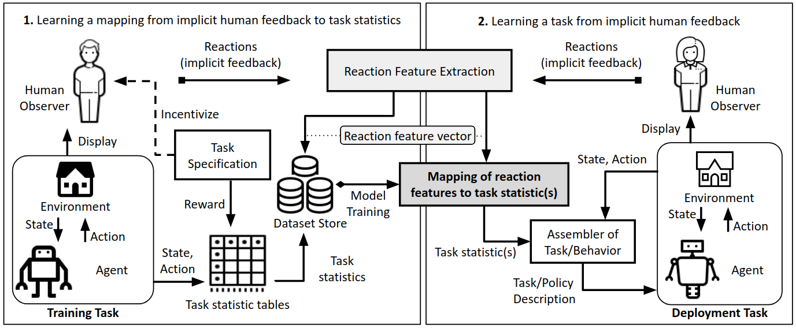

# The EMPATHIC Framework for Task Learning from Implicit Human Feedback

Yuchen Cui*, Qiping Zhang*, Alessandro Allievi, Peter Stone, Scott Niekum, W. Bradley Knox

<p align="center">
  <a href="https://arxiv.org/abs/2009.13649">View paper on ArXiv</a> |
  <a href="https://sites.google.com/utexas.edu/empathic">Project Website</a>
</p>


Overview of the EMPATHIC framework:
<p align=center>
  
</p>


This repository contains code used to conduct experiments reported in the paper "The EMPATHIC Framework for Task Learning from Implicit Human Feedback" published at CoRL 2020.

If you find this repository is useful in your research, please cite the paper:
```
@article{cui2020empathic,
  title={The EMPATHIC Framework for Task Learning from Implicit Human Feedback},
  author={Cui, Yuchen and Zhang, Qiping and Allievi, Alessandro and Stone, Peter and Niekum, Scott and Knox, W Bradley},
  journal={arXiv preprint arXiv:2009.13649},
  year={2020}
}
```


# Instructions for running source code


## Clone the Repository 

```git clone --recursive https://github.com/Pearl-UTexas/EMPATHIC.git```


## Requirements
All modules require Python 3.6 or above. 

- [install anaconda](https://docs.anaconda.com/anaconda/install/)
- [install pytorch](https://pytorch.org/get-started/locally/)
- [install openface2.0](https://github.com/TadasBaltrusaitis/OpenFace)


To install all Python dependencies, run:
```
python -m pip install --upgrade -r requirements.txt
```

---------------------------------------------------------------------------------------
## Test Online Learning

Specify the path to your OpenFace installation in `start_openface.bash`

Run online learning (a webcam that can see your face is required):
```
python online_learning.py
```
(you may need to manually kill the process when it finishes)


---------------------------------------------------------------------------------------
## Training Human Reaction Mappings

Download the pre-processed dataset from [here](https://drive.google.com/file/d/16O4K5UEUiu7L9AtgPfKxaoK7Y80p6iG2/view?usp=sharing), and extract the files in a directory called detected/.


### Training on per-subject datasets

```
python train_mlp_net_facs.py WkOsToXr9v
```

This will generate a model file "WkOsToXr9v_[lowest_test_loss].pkl" of the trained MLP in the directory MLP_facs_reward_models/, for testing on the human subject data with ID "WkOsToXr9v". 

Note that if you would like to train a model for another subject, you need to make sure the processed data of that subject already exists in a subdirectory with the name of his/her ID, under the folder detected/. 

Per-subject models are used for random search of hyper-parameters.

### Training on single-model dataset
```
python train_mlp_net_facsall.py 
```

This will generate a model file "allsubjects_[lowest_test_loss].pkl" of the trained MLP in the directory MLP_facs_reward_models/. 

The trained model is used for evaluating data in holdout set.

## Predicting Reward Rankings

```
python test_facs.py WkOsToXr9v
```

## Using Robotaxi Environment

To play the Robotaxi game, update the environment, replay recorded trajectories, and collect new user-study data, refer to the repository: [Robotaxi](https://github.com/Pearl-UTexas/RobotaxiEnv).
